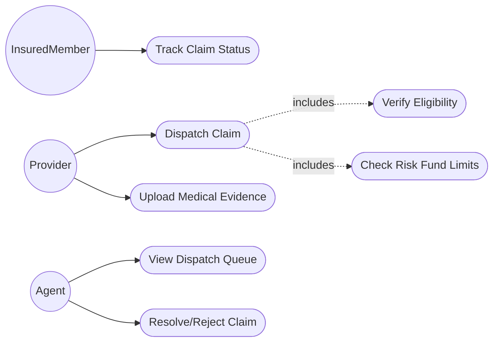
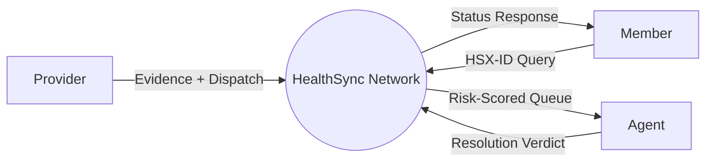
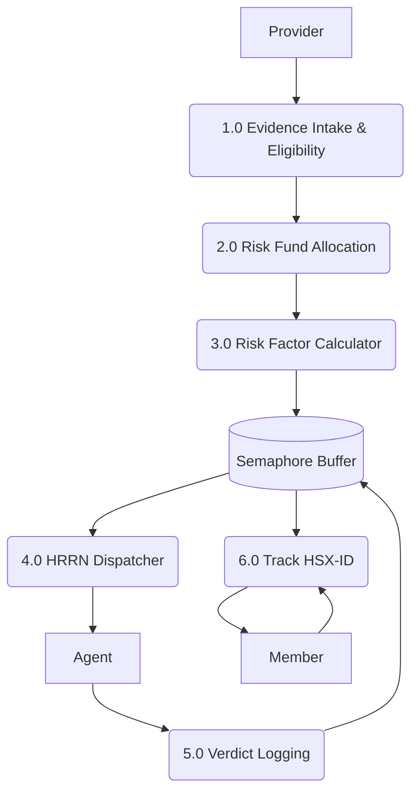
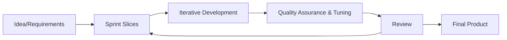

# Project Title: HealthSync Network (Automated Medical Claim Processing & Fraud Verification)

## Submitted To

Miss Umna Iftikhar

## Submitted By

M.Dawood Ali

## Date of Submission

15/6/2026

---

## Abstract

The HealthSync Network is a modernized software framework designed to combat the traditional flaws in health insurance claim processing. By heavily integrating Operating System principles, the platform solves complex logistical problems natively. A Semaphore-based dispatch buffer orchestrates Provider inputs and Agent reviews, while a Risk Fund Matrix utilizes Banker's Algorithm to guarantee financial stability. Enhanced with an HRRN (Highest Response Ratio Next) CPU scheduler, it minimizes agent idle time and prioritizes critical, high-risk claims. The inclusion of a Member Portal empowers policyholders with direct tracking access, significantly increasing transparency.

## Letter of Acknowledgment

Respected Miss Umna Iftikhar,
We sincerely thank you for your incredible support and guidance throughout this project. Translating the theoretical concepts of Operating Systems into a tangible, functioning application was a challenging but immensely rewarding CCP experience, made possible by your insightful feedback.

---

## Table of Contents

1. Problem Statement
2. Scope of the System
3. Features of the System
4. Functional and Non-Functional Requirements
5. Meta Data and Use Case Diagram
6. Data Flow Diagrams
7. Suggested Process Model
8. CCP Attributes mapped

---

## Problem Statement

National insurance networks struggle with the massive influx of medical claims from distributed providers. The manual validation of policy eligibility and the subjective detection of fraudulent files result in severe operational bottlenecks. Providers wait weeks for compensation, and members have zero visibility into their claim's status. HealthSync aims to centralize this environment, automatically routing eligible claims to Agents, flagging fraud, and maintaining a strict, deadlock-free resource matrix.

## Scope of the System

**In-Scope:**

- Semaphore-controlled claim dispatching for Providers.
- Upload functionality for medical evidence.
- Eligibility verification checks (blocking ineligible patients).
- Risk Fund Matrix validation (Banker's logic).
- Automated Risk Factor / Fraud evaluation.
- Dedicated Member Portal for status tracking.
- HRRN, SJF, and FCFS agent scheduling.

**Out-of-Scope:**

- Integration with third-party medical billing APIs.
- Deep Neural Network fraud training models.
- International currency conversion for settlements.

## Features of the System

1. Role-specific Consoles (Member, Provider, Agent).
2. Document attachment capabilities.
3. Automated Risk Factor generation scaling up to 100%.
4. Kernel-level Terminal Logging for transparency.
5. Random Page Replacement memory block simulation.

## Functional and Non-Functional Requirements

**Functional Requirements:**

- The network must allow Providers to attach documents and dispatch claims.
- The network must block claims if the patient is marked Not Eligible.
- The network must compute a Fraud Risk Factor automatically.
- The network must provide Agents with tools to Resolve or Reject claims.
- The network must allow Insured Members to track their IDs.

**Non-Functional Requirements:**

- Ensure robust concurrent access management using Semaphore logic.
- Ensure isolated data views for different actors.
- Scale gracefully even under heavy dispatch loads.

---

## Meta Data and Use Case Diagram

**Meta Data:** The database stores objects for `Members`, `Providers`, `Agents`, `DispatchBuffer` (Tracking Arrival time, Burst time, File name, Risk Factor), and the `RISK_FUND` constraints.

---

## Data Flow Diagrams (DFDs)

### Context Diagram (Level 0)

### Parent Diagram (Level 1)

---

## Suggested Process Model

**Chosen Model:** Agile Framework
**Justification:** Developing an OS-themed network application required constant iterative testing, particularly when balancing the HRRN scheduling algorithms and the Banker's matrix logic. Agile allowed us to quickly adjust the semaphore limits and fraud scoring weights based on immediate testing feedback.

---

## CCP Attributes mapped

| Attributes of Complex Problem Solving             | Justification                                                                                                                                                                                 |
| :------------------------------------------------ | :-------------------------------------------------------------------------------------------------------------------------------------------------------------------------------------------- |
| **WP1 (Range of Conflicting Requirements)** | Managing the conflicting requirements of fast claim resolution versus thorough fraud scanning required implementing a highly optimized Highest Response Ratio Next (HRRN) queue.              |
| **WP2 (Depth of Analysis required)**        | Formulating the Risk Fund matrix and deciding exactly when a state transitions from safe to unsafe demanded rigorous mathematical analysis.                                                   |
| **WP3 (Depth of Knowledge required)**       | A deep understanding of OS process synchronization, specifically Semaphore management, was mandatory to prevent buffer overflows during high-volume testing.                                  |
| **WP7 (Consequences)**                      | Approving a fraudulent or highly risky claim could lead to immediate financial loss; thus, consequence mapping was embedded directly into the Banker's algorithm checks.                      |
| **WP8 (Interdependence)**                   | The Member tracking module is highly interdependent on the Agent's resolution speed. The system's entire perceived transparency relies on the seamless flow from Provider to Agent to Member. |
